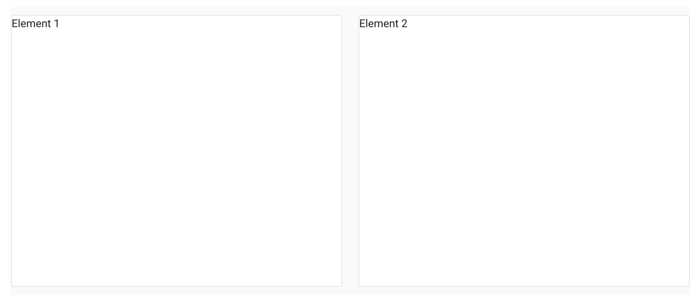
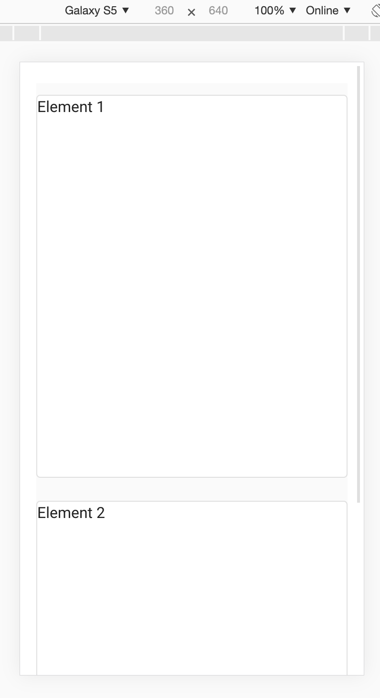

Advanced Usage
==============

(Scoped) Slots
--------------

Slots are used to add content at a certain location in a widget. You can find out what slots a widget supports by using
the Vuetify documentation. If you want to know what slots :code:`Select` has, search for :code:`v-select` on the
`Vuetify API explorer <https://v2.vuetifyjs.com/components/api-explorer/>`_ or for this example use the `direct link
<https://v2.vuetifyjs.com/en/components/selects/#api>`_. On the left-hand side of list of attributes you will find a tab
'slots'.

An example for using the slot 'no-data', which changes what the Select widget shows when it has no items:

Vuetify:

.. code-block:: html

    <v-select>
      <template v-slot:no-data>
        <v-list-item>
          <v-list-item-title>
            My custom no data message
          </v-list-item-title>
        </v-list-item>
      </template>
    </v-select>

ipyvuetify:

.. jupyter-execute::
    :hide-output:
    :hide-code:

    import ipyvuetify as v

.. jupyter-execute::

    v.Select(v_slots=[{
        'name': 'no-data',
        'children': [
            v.ListItem(children=[
                v.ListItemTitle(children=['My custom no data message'])])]
    }])

Scoped slots are used if the parent widget needs to share its scope with the content. In the example below the events
of the parent widget are used in the slot content.

Vuetify:

.. code-block:: html

    <v-tooltip>
        <template v-slot:activator="tooltip">
            <v-btn v-on="tooltip.on" color="primary">
                button with tooltip
            </v-btn>
        </template>
        Insert tooltip text here
    </v-tooltip>

ipyvuetify:

.. jupyter-execute::

    v.Container(children=[
        v.Tooltip(bottom=True, v_slots=[{
            'name': 'activator',
            'variable': 'tooltip',
            'children': v.Btn(v_on='tooltip.on', color='primary', children=[
                'button with tooltip'
            ]),
        }], children=['Insert tooltip text here'])
    ])

In the Vuetify examples you will actually see:

.. code-block:: html

    ...
    <template v-slot:activator="{ on }">
        <v-btn v-on="on">
    ...

Instead of the functionally equivalent (like used in the example above):

.. code-block:: html

    ...
    <template v-slot:activator="tooltip">
        <v-btn v-on="tooltip.on">
    ...

The :code:`{ on }` is JavaScript syntax for destructuring an object. It takes the 'on' attribute from an object and
exposes it as the 'on' variable.

.. note::

    The 'default' slot can be ignored, this is where the content defined in the :code:`children` attribute goes.

Responsive Layout
-----------------

When making dashbords with Voilà you can change the layout depending on the users screen size. This is done with a `grid
system <https://v2.vuetifyjs.com/en/components/grids/>`_. For example on a laptop (breakpoint md) you could fit two
elements next to each other while on a smartphone (defined with 'cols' as default) you would want one element to take up
the full width:

.. jupyter-execute::
    :hide-output:

    v.Row(children=[
        v.Col(cols=12, md=6, children=[
            v.Card(outlined=True, style_='height: 400px', children=[f'Element {i}'])
        ]) for i in range (1,3)
    ])

Which displays on a laptop as:

On a phone as:

In the `display section <https://v2.vuetifyjs.com/en/styles/display/>`_ you will find CSS helper classes to do more
customizations based on screen size.

Event modifiers
---------------

In Vue `event modifiers <https://vuejs.org/v2/guide/events.html#Event-Modifiers>`_ can be used to change event behavior.

For example when you have two nested elements and want a different click handler for the inner and outer element, the
``stop`` event modifier can be used by appending ``.stop`` to the event name:

.. jupyter-execute::

    icon = v.Icon(right=True, children=['mdi-account-lock'])
    btn = v.Btn(color='primary', children=[
        'button',
        icon
    ])

    icon.on_event('click.stop', lambda *args: print('icon clicked'))
    btn.on_event('click', lambda *args: print('btn clicked'))

    v.Container(children=[
        btn
    ])

    # Note: the event handlers won't work in this page because there is no active kernel.

.sync
-----

When you see ``.sync`` appended to an attribute in Vuetify syntax, it means the attribute has a `two-way binding
<https://vuejs.org/v2/guide/components-custom-events.html#sync-Modifier>`_ (like ``v-model``). This is shorthand in Vue
that automatically listens to an event named ``update:<attributeNameInCamelCase>``.

We can achieve the same manually in ipyvuetify by setting an event handler
``<widget>.on_event('update:<attributeNameInCamelCase>', <function>)``

Vuetify:

..  code-block:: none

    <v-navigation-drawer :mini-variant.sync="someProperty" ...

ipyvuetify:

.. code-block:: none

    drawer = v.NavigationDrawer(mini_variant=True, ...)

    def update_mini(widget, event, data):
        drawer.mini_variant = data

    drawer.on_event('update:miniVariant', update_mini)
