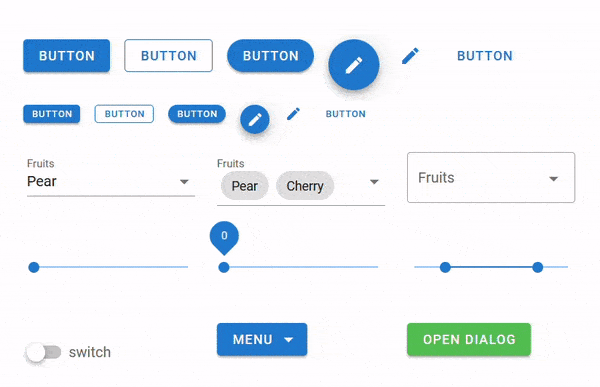
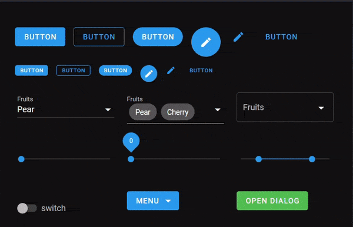

:html_theme.sidebar_secondary.remove:

.. raw:: html

    <!-- CSS overwrite for the landing page only -->
    

ipyvuetify: Jupyter widgets based on Vuetify UI components
==========================================================

.. raw:: html

    

        

IpyVuetify
----------

Jupyter widgets based on Vuetify UI components
^^^^^^^^^^^^^^^^^^^^^^^^^^^^^^^^^^^^^^^^^^^^^^

**Ipyvuetify** is a widget library for making modern-looking GUIs in Jupyter notebooks (`classic <https://github.com/jupyter/notebook>`__, `lab <https://github.com/jupyterlab/jupyterlab>`__, `lite <https://github.com/jupyterlite/jupyterlite>`__) and dashboards (`Voilà <https://github.com/voila-dashboards/voila>`__, `Voici <https://github.com/voila-dashboards/voici>`__). Based on the `Vuetify UI <https://v2.vuetifyjs.com/en/>`__ library, it extends the standard Jupyter widget library with additional widgets that are more customizable and composable.

.. raw:: html

    <!-- these button are only displayed in the html build -->
    

        

            <a href="#" class="btn btn-lg sd-btn-primary">Get Started</a>
            <a href="#" class="btn btn-lg sd-btn-outline-primary">See Gallery</a>
        

        

            <a href="#">See API Reference →</a>
        

    

.. raw:: html

    
 <!-- hero-left -->
    

.. raw:: html

    
 <!-- hero-right -->
    
 <!-- hero -->

.. toctree::
    :hidden:

    introduction
    installation
    usage
    advanced_usage
    template_usage
