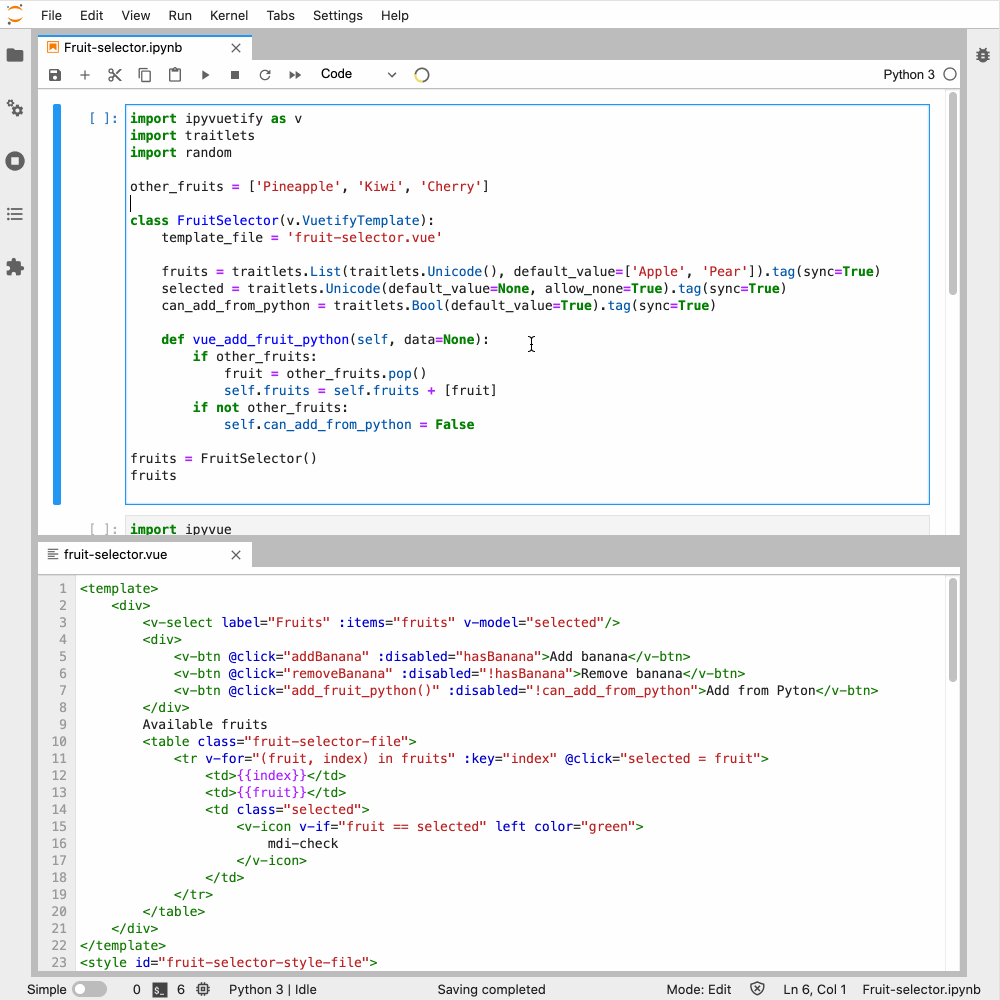

Template Usage
==============

First template
--------------

When building larger UI's it may be convenient to write composite widgets using
the Vue template syntax. Lets start with a basic example:

.. jupyter-execute::

    import ipyvuetify as v
    import traitlets

    class FruitSelector(v.VuetifyTemplate):
        fruits = traitlets.List(traitlets.Unicode(), default_value=['Apple', 'Pear']).tag(sync=True)
        selected = traitlets.Unicode(default_value=None, allow_none=True).tag(sync=True)
        @traitlets.default('template')
        def _template(self):
            return '''
            <template>
                

                    <v-select label="Fruits" :items="fruits" v-model="selected"/>
                

            </template>
            '''
    fruits = FruitSelector()
    fruits

The general pattern is to:
    * Inherit from ``VuetifyTemplate``
    * Define traits which will be available as ``data`` in your Vue template.
    * Return a Vue template string as default value for the ``template`` trait.

Advanced template
-----------------

While the first template is actually more code than simply creating a
``v.Select`` widgets, this next example will demonstrate a Vue feature not
available using the normal wrapped Vuetify widgets:

.. jupyter-execute::

    import ipyvuetify as v
    import traitlets

    class FruitSelector(v.VuetifyTemplate):
        fruits = traitlets.List(traitlets.Unicode(), default_value=['Apple', 'Pear']).tag(sync=True)
        selected = traitlets.Unicode(default_value=None, allow_none=True).tag(sync=True)
        @traitlets.default('template')
        def _template(self):
            return '''
                <template>
                    

                        <v-select label="Fruits" :items="fruits" v-model="selected"/>
                        Available fruits
                        <table class="fruit-selector">
                            <tr v-for="(fruit, index) in fruits" :key="index" @click="selected = fruit">
                                <td>{{index}}</td>
                                <td>{{fruit}}</td>
                                <td>{{fruit == selected ? "selected" : ""}}</td>
                            </tr>
                        </table>
                    

                </template>
                
                
            '''
    fruits = FruitSelector(fruits=['Banana', 'Pear', 'Apple'])
    fruits

In this example we make use of the `list rendering feature of Vue
<https://vuejs.org/v2/guide/list.html/>`_ so that we only have to synchronize a
list of strings, and not create a widget for every fruit we want to display.

.. note::
    By giving the ``<style>`` tag an id attribute, we can remove the old css when the notebook cell gets executed multiple times, this is useful when developing in the Jupyter notebook.

Template in vue files
---------------------

Although a powerful feature, programming Vue templates in a string is quite
cumbersome, since you lose syntax highlighting and other advanced editor
features. Instead, we can put out Vue template into a ``.vue`` file, and point
our VuetifyTemplate to it.

Vuetify template ``fruit-selector.vue``:

.. literalinclude:: fruit-selector.vue
    :language: html

Python:

.. code-block:: python

    import ipyvuetify as v
    import traitlets
    import random

    other_fruits = ['Pineapple', 'Kiwi', 'Cherry']

    class FruitSelector(v.VuetifyTemplate):
        template_file = 'fruit-selector.vue'

        fruits = traitlets.List(traitlets.Unicode(), default_value=['Apple', 'Pear']).tag(sync=True)
        selected = traitlets.Unicode(default_value=None, allow_none=True).tag(sync=True)
        can_add_from_python = traitlets.Bool(default_value=True).tag(sync=True)

        def vue_add_fruit_python(self, data=None):
            if other_fruits:
                fruit = other_fruits.pop()
                self.fruits = self.fruits + [fruit]
            if not other_fruits:
                self.can_add_from_python = False

In this example we demonstrate a few new features:

    * ``vue_add_fruit_python`` can be used as an event handler from the Vue template (exposed without the ``vue_`` prefix)
    * Vue `Methods <https://vuejs.org/v2/api/#methods>`_.
    * `Computed properties and watches <https://vuejs.org/v2/guide/computed.html>`_.

Hot reloading
-------------

Now that your Vue templates are in a file, we can add a file watch to support hot reloading:

.. code-block:: python

    import ipyvue
    ipyvue.watch()

A demonstration in a screen capture:

.. note::
    For this feature we require the watchdog packages. Install it using ``pip install "watchdog>=2.0"`` or ``conda install -c conda-forge "watchdog>=2.0"``

Embed ipywidgets
----------------

Other ipywidgets can be embedded by setting them in a trait and adding widget_serialization, accessing them in the with the `jupyter-widget` tag:

.. code-block:: python

    import ipyvuetify as v
    import ipywidgets as widgets
    import traitlets

    slider1 = widgets.IntSlider(description='Slider 1', value=20)
    slider2 = v.Slider(label="Slider 2", v_model="8")

    class MyComponent(v.VuetifyTemplate):

        items = traitlets.List([{
            'title': 'Title 1',
            'content': slider1
        }, {
            'title': 'Title 2',
            'content': slider2
        }]).tag(sync=True, **widgets.widget_serialization)

        single_widget = traitlets.Any(
            widgets.IntSlider(description='Single slider', value=40)
        ).tag(sync=True, **widgets.widget_serialization)

        @traitlets.default('template')
        def _template(self):
            return """
            <template>
                

                    

                        {{ item.title }}: <jupyter-widget :widget="item.content" />
                    

                    Single widget: <jupyter-widget :widget="single_widget" />
                

            </template>
            """

    MyComponent()
